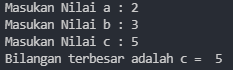

## **Algoritma Program**

Diketahui 3 buah bilangan bil1,bil2,bil3, akan dicari nilai yang terbesar.

1. Mulai
2. Inisiasi bil1,bil2,bil3 sebagai integer.
3. Jika bil1 > bil2 dan bil1 > bil3 maka
4. kerjakan langkah 8, selain itu
5. Jika bil2 > bil1 dan bil2 > bil3 maka
6. kerjakan langkah 9, selain itu kerjakan langkah 10.
7. Cetak “Bilangan Terbesar”.
8. Selesai

## **Flowchart**

## **Screenshot Output Program 3 input**

